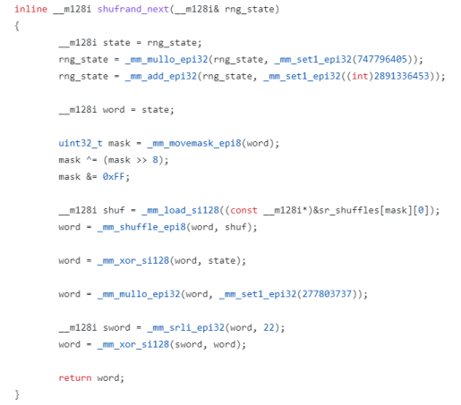

# shufrand
Vectorized (SSE 4.1) non-cryptographic pseudorandom number generator ([PCG](https://en.wikipedia.org/wiki/Permuted_congruential_generator) variant). Public domain: [unlicense.org](https://unlicense.org/).

## Intro

This is a SSE 4.1 modified variant of O’Neill's 32-bit “RXS-M-XS” PCG (Permuted Congruential Generator) PRNG. A plain C (non-vectorized) implementation is also included for validation/porting. Unfortunately, `_mm_srlv_epi32()` (variable lane shift right), which is used by the original scalar PCG implementation, requires AVX-2, not SSE 4.1, so I had to find a vectorized workaround compatible with SSE 4.1 that is still fast. One fast and simple alternative, which is a reversible integer function, is a table-driven byte permutation. This can be implemented using `_mm_movemask_epi8()`, some sort of table lookup based off a function of the returned 16 mask bits, followed by `_mm_shuffle_epi8()`.

I'm mostly releasing this as a demonstration. Most vectorized PRNG's I've seen are vanilla ports of scalar functions which don't exploit x86 vector shuffle ops. These instructions are very powerful and popular, and they have much lower latency than 32-bit muls. New PRNG's should consider exploiting these operations as first-class citizens. The original idea of using vector shuffles for fast PRNG's is due to Stephan Schaem (as far as I can tell), see [flipcode.com](https://www.flipcode.com/archives/07-15-2002.shtml).

## The SSE 4.1 function

The core [random function](https://github.com/richgel999/shufrand/blob/main/shufrand.h#L65) returns 4 floats in a `__m128i` register. Apart from replacing the variable shift right with a cross-lane vector shuffle, the LCG and the final stage's mul+xor shift are unmodified:

This implementation uses 4 different 32-bit LCG's running in parallel, each with different states, so its period is still 2^32. However, the entropy of each independent 32-bit generator is spread between all the lanes in a 128-bit register, because doing so is cheap to do with a single shuffle. So it's a strange low period hybrid between a 32-bit generator, and something larger. You can treat the results as 4 32-bit outputs up to a single 128-bit output.

## The permutation table

The trickiest part to getting this working (i.e. reliably passing various tests) was computing a suitable permutation table. The table precomputation approach I used has the following constraints (which are probably not optimal, but this seems to work):
- A byte in a lane cannot be permuted against itself (obviously, or it would always result in 0 once XOR'd against the input vector, losing information)
- "Low bytes" (the ones at offset 0 in each of the 4 lanes, i.e. the LSB) cannot be XOR'd into the low bytes of any other lane. The lowest byte of LCG's have the least amount of entropy (they cycle relatively quickly), so we want to XOR higher entropy bytes into these low bytes. This better diffuses the entropy we do have across all the lanes.
- For each of the 4 lanes, only 1 low byte from another lane is allowed to be XOR'd into that lane. This is to prevent XOR'ing in too many weak bytes into a lane.

Many other variations on this approach are possible. I'm sure the included 256 entry table can be improved. I experimented with 16 entry tables, but had little success with them. The permutation table seems to be this approach's weakest link, and if this generator has a key flaw I would bet it's in the current table.

## Using the generator
In C++, `#include shufrand.h`. All the functionality is inlined. You'll need to link against `shufrand.cpp`, which includes the table in `shufrand.inl`. All the other files are for testing purposes only. **Importantly**, after picking the 4 lane seeds, always immediately call the generator once (`shufrand_next()`) to prime it. **Also make sure each lane's seed is different, or you'll effectively only have one to three 32-bit generators instead of four parallel 32-bit generators.**

## Current test results

This PRNG passes dieharder, TestU01 SmallCrush and Crush. With dieharder, I get 0-3 "weak" results, but usually no failures, depending on the initial seeds. It seems to be weakest with the "dab_bytedistrib" test. The testing logs are in the repo. BigCrush is still testing; let's see what happens. I'm quite doubtful it'll pass BigCrush because at its heart this is still just 4 32-bit generators ganged together with a fancy bitmix across lanes. 

The SmallCrush/Crush tests pass each lane to the TestU01 test framework one uint32_t at a time, i.e. as if the generator was returning 128-bits (which it is). In other words, on each callback from the test framework, the next available uint32_t is passed to the test. This may or may not be ideal, but it was the first thing that came to mind. I tried this using both forward and reversed bits in each lane. I'll be re-running the test using individual lanes next.

## Mini-Rant on PRNG's

Historically, even the supposedly best or most respected PRNG's turn out to eventually fail some tests, sometimes many years later. I remember 26 years ago, the [Mersenne Twister](https://en.wikipedia.org/wiki/Mersenne_Twister) was all the rage, and now it's questionable/deprecated. Just because a generator passes some tests doesn't mean it's actually any good. At this point in my career, I'm honestly skeptical and leary of ALL non-cryptographic PRNG's. Use them all (including this one!) at your own risk. For real simulation work I would consider combining together multiple generators (using XOR) that use completely different approaches, and test the results. This should help as a hedge in case one or more are actually flawed in some way that is currently undetected. **Odds are, historically speaking, all current generators considered strong have undetected flaws.**

## Key Links/References:  
- https://www.pcg-random.org/
- https://www.pcg-random.org/pdf/hmc-cs-2014-0905.pdf
- https://www.flipcode.com/archives/07-15-2002.shtml
- https://jcgt.org/published/0009/03/02/
- https://www.reedbeta.com/blog/hash-functions-for-gpu-rendering/
- http://marc-b-reynolds.github.io/math/2017/10/13/IntegerBijections.html
- https://www.pcg-random.org/posts/how-to-test-with-testu01.html
- https://linux.die.net/man/1/dieharder
- https://github.com/imneme/pcg-c/blob/83252d9c23df9c82ecb42210afed61a7b42402d7/include/pcg_variants.h#L504
- https://en.wikipedia.org/wiki/Probability_box
